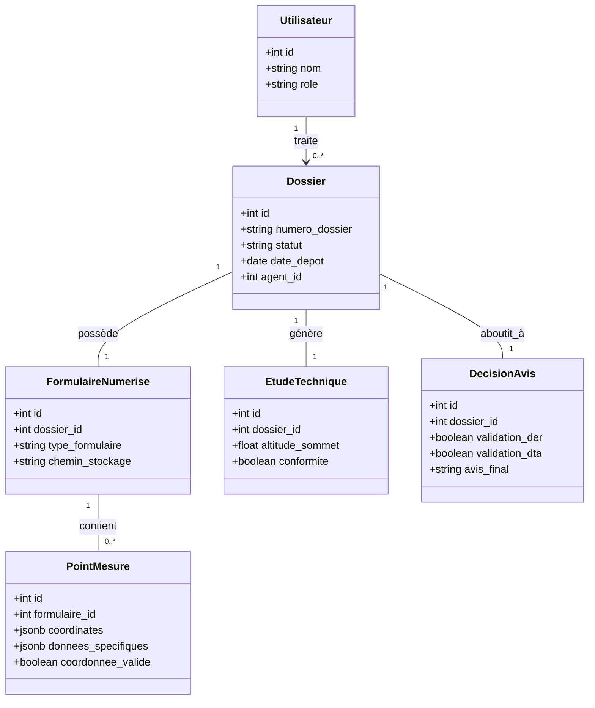

# Architecture de la Base de Données - Système d'Avis Aéronautiques (OACA)

Ce document décrit l'architecture de données conçue pour la gestion et l'automatisation du traitement des dossiers de demande d'avis aéronautiques.

## 1. Structure de la Base de Données

Le système utilise une architecture relationnelle centrée sur le `Dossier`, avec une extension flexible via le type JSONB pour les caractéristiques techniques des obstacles.

### Diagramme de Classe (Mermaid)



## 2. Justification du choix JSONB

Le système doit traiter différents types d'obstacles (Éoliennes, Bâtiments, Pylônes, Grues), chacun ayant des attributs techniques distincts. 

L'utilisation de colonnes fixes aurait entraîné un schéma très creux (beaucoup de valeurs `NULL`) ou une multiplication des tables. Le type **JSONB** de PostgreSQL a été choisi pour la colonne `donnees_specifiques` car il permet :
- **Flexibilité du Schéma :** Ajouter des attributs sans modifier la structure de la table.
- **Performance :** Contrairement au JSON classique, le JSONB est stocké en format binaire décomposé, permettant l'indexation et des recherches rapides.
- **Adaptabilité :** Chaque type d'obstacle possède son propre jeu de données.

### Exemple de valeur JSONB pour une Éolienne
```json
{
  "diametre_rotor": 120,
  "hauteur_moyeu": 85,
  "type_pale": "composite",
  "puissance_mw": 3.5,
  "constructeur": "Vestas",
  "est_balisage_installe": true,
  "angle_orientation": 180,
  "date_installation": "2023-05-12"
}
```
*Note : Pour un bâtiment, on stockerait plutôt `{"emprise_sol": "20x30m", "nombre_etages": 5, "materiau_facade": "verre"}`.*

## 3. Schéma SQL de création des tables

```sql
-- 1. Création des types ENUM
CREATE TYPE statut_dossier AS ENUM ('en_attente', 'en_cours', 'traite', 'incomplet');
CREATE TYPE user_role AS ENUM ('agent', 'responsable', 'admin');

-- 2. Table Utilisateurs
CREATE TABLE utilisateurs (
    id SERIAL PRIMARY KEY,
    nom VARCHAR(100) NOT NULL,
    email VARCHAR(150) UNIQUE NOT NULL,
    role user_role NOT NULL
);

-- 3. Table Dossiers
CREATE TABLE dossiers (
    id SERIAL PRIMARY KEY,
    numero_dossier VARCHAR(50) UNIQUE NOT NULL,
    nom_demandeur VARCHAR(255) NOT NULL,
    identifiant_depositaire VARCHAR(100),
    region VARCHAR(100),
    type_demande VARCHAR(50),
    statut statut_dossier DEFAULT 'en_attente',
    avis VARCHAR(50) DEFAULT 'non_genere',
    complement TEXT,
    observations TEXT,
    date_depot DATE,
    date_traitement DATE,
    agent_id INTEGER REFERENCES utilisateurs(id)
);

-- 4. Table Formulaires Numérisés
CREATE TABLE formulaires_numerises (
    id SERIAL PRIMARY KEY,
    dossier_id INTEGER UNIQUE NOT NULL REFERENCES dossiers(id),
    nom_fichier VARCHAR(255) NOT NULL,
    format VARCHAR(20),
    type_formulaire VARCHAR(50),
    nombre_pages INTEGER DEFAULT 1,
    marqueur_aruco INTEGER,
    chemin_stockage VARCHAR(500),
    date_upload TIMESTAMP DEFAULT CURRENT_TIMESTAMP
);

-- 5. Table Points de Mesure (Cœur de l'extraction)
CREATE TABLE points_mesure (
    id SERIAL PRIMARY KEY,
    formulaire_id INTEGER NOT NULL REFERENCES formulaires_numerises(id),
    numero_ligne INTEGER NOT NULL,
    coordinates JSONB NOT NULL, -- Stocke {"lat": ..., "lon": ...}
    donnees_specifiques JSONB,   -- Stocke les attributs variables par obstacle
    coordonnee_valide BOOLEAN DEFAULT FALSE,
    corrigee_manuellement BOOLEAN DEFAULT FALSE,
    page_source INTEGER DEFAULT 1
);

-- 6. Table Étude Technique
CREATE TABLE etudes_techniques (
    id SERIAL PRIMARY KEY,
    dossier_id INTEGER UNIQUE NOT NULL REFERENCES dossiers(id),
    altitude_sommet FLOAT,
    altitude_terrain FLOAT,
    distance_aerodrome FLOAT,
    conformite BOOLEAN,
    date_analyse TIMESTAMP DEFAULT CURRENT_TIMESTAMP
);

-- 7. Table Décision et Avis
CREATE TABLE decisions_avis (
    id SERIAL PRIMARY KEY,
    dossier_id INTEGER UNIQUE NOT NULL REFERENCES dossiers(id),
    validation_der BOOLEAN DEFAULT FALSE,
    validation_dta BOOLEAN DEFAULT FALSE,
    validation_dana BOOLEAN DEFAULT FALSE,
    validation_dna BOOLEAN DEFAULT FALSE,
    avis_final VARCHAR(100),
    date_decision TIMESTAMP DEFAULT CURRENT_TIMESTAMP
);

-- Indexation pour la performance
CREATE INDEX idx_dossier_statut ON dossiers(statut);
CREATE INDEX idx_point_mesure_formulaire ON points_mesure(formulaire_id);
CREATE INDEX idx_formulaire_dossier ON formulaires_numerises(dossier_id);
CREATE INDEX idx_point_mesure_specifiques ON points_mesure USING GIN (donnees_specifiques);
```

## 4. Requêtes Critiques

### 1. Identification des dossiers avec coordonnées invalides
Cette requête permet aux agents de lister rapidement les dossiers nécessitant une correction manuelle des points extraits.
```sql
SELECT d.numero_dossier, d.nom_demandeur, pm.numero_ligne, pm.coordinates
FROM dossiers d
JOIN formulaires_numerises fn ON d.id = fn.dossier_id
JOIN points_mesure pm ON fn.id = pm.formulaire_id
WHERE pm.coordonnee_valide = FALSE;
```

### 2. Statistiques pour le Tableau de Bord
Calcul du nombre de dossiers par statut et par type d'obstacle pour le suivi de la charge de travail.
```sql
SELECT d.statut, fn.type_formulaire, COUNT(*) as total
FROM dossiers d
JOIN formulaires_numerises fn ON d.id = fn.dossier_id
GROUP BY d.statut, fn.type_formulaire
ORDER BY total DESC;
```

### 3. Recherche technique dans le JSONB
Trouver toutes les éoliennes dont la hauteur du moyeu est supérieure à 100 mètres.
```sql
SELECT d.numero_dossier, pm.donnees_specifiques->>'hauteur_moyeu' as hauteur
FROM dossiers d
JOIN formulaires_numerises fn ON d.id = fn.dossier_id
JOIN points_mesure pm ON fn.id = pm.formulaire_id
WHERE fn.type_formulaire = 'EOLIENNE' 
AND (pm.donnees_specifiques->>'hauteur_moyeu')::float > 100;
```

### 4. Vue complète d'un dossier (Jointure Globale)
Récupération de toutes les informations liées à un dossier spécifique pour l'affichage dans l'interface de gestion.
```sql
SELECT 
    d.*, 
    fn.type_formulaire, 
    et.conformite, 
    da.avis_final,
    (SELECT json_agg(pm.*) FROM points_mesure pm WHERE pm.formulaire_id = fn.id) as points
FROM dossiers d
LEFT JOIN formulaires_numerises fn ON d.id = fn.dossier_id
LEFT JOIN etudes_techniques et ON d.id = et.dossier_id
LEFT JOIN decisions_avis da ON d.id = da.dossier_id
WHERE d.numero_dossier = 'DOSS-2026-001';